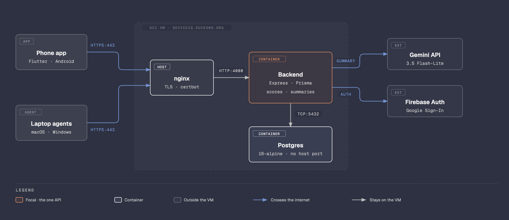

# DeviceIQ

**Battery widgets, with no Bluetooth constraints and no platform lock-in.**

The idea started from the battery widgets in Apple's ecosystem, which show how your devices are
doing but stay tied to nearby Bluetooth connections and to Apple's own hardware. DeviceIQ does
the same job over the internet, so distance does not matter, and it works across Android, macOS
and Windows.

Check on your laptop's battery, storage and memory from your phone, without being near it.

DeviceIQ has a phone app and a small background agent for macOS and Windows. Each device sends
a health snapshot to one shared backend, and the phone shows every device you have linked, each
with a 0 to 100 health score and a short AI-written explanation of what the score means.

The backend is already running at `https://deviceiq.duckdns.org`. You do not need to set up a
server, a database or any keys to use the app.

DeviceIQ is under active development, so features will keep arriving and things may change or
break along the way.



The backend and Postgres are two containers on the same VM, and Postgres is reachable only from
the backend. The phone and the agents also sign in with Google directly, which the backend never
sees: it only checks the tokens they send it.

## What you see

- **A card per device**, with battery level and health, charging state, temperature, storage,
  memory and the time of the last update.
- **A health score** for each device. Tap a card to see the score and how each part contributes.
- **An AI summary** of that score, in a few plain sentences with one suggested action.
- **Linked laptops**, which you can rename or unlink from the phone. Deleting your account from
  the app removes all of your data.

## Get started

You need the Android app first, because a laptop is linked to your account by scanning a QR code
with the phone.

### 1. Install the Android app

1. Download `app-release.apk` from the
   [latest release](https://github.com/rue08/device-iq/releases/latest) onto your phone.
2. Open the file. Android will ask you to allow installs from this source. Allow it for this one
   install.
3. Open **DeviceIQ** and tap **Sign in with Google**.

The phone reports its own battery, storage and memory. Tap **Take snapshot now** on the phone's
card to upload a reading.

> The app is Android only. It has to be the APK from the release: Google Sign-In only accepts
> apps signed with the maintainer's key, so an APK built from this source will not be able to
> sign in.

### 2. Link a Mac

You need macOS 13 or later and the Swift toolchain (run `xcode-select --install` if you do not
have it).

```bash
git clone https://github.com/rue08/device-iq.git
cd device-iq/macos-agent
swift build -c release
.build/release/DeviceIQAgent
```

A laptop icon appears in the menu bar. Choose **Link This Device…** to show a QR code. On the
phone, tap the **Link a laptop** icon in the top bar, scan the code, choose **Mac** and tap
**Link this laptop**. The agent finishes setup by itself within a few seconds, sends a first snapshot straight away
and then one every 10 minutes.

To start it automatically at login:

```bash
# 1. Print the folder that holds the built binary
swift build -c release --show-bin-path
# 2. Open com.deviceiq.agent.plist and replace /REPLACE/WITH/PATH/TO/DeviceIQAgent
#    with <that folder>/DeviceIQAgent
# 3. Install it
cp com.deviceiq.agent.plist ~/Library/LaunchAgents/
launchctl load ~/Library/LaunchAgents/com.deviceiq.agent.plist
```

To remove it: `launchctl unload ~/Library/LaunchAgents/com.deviceiq.agent.plist`, then delete
that file.

### 3. Link a Windows laptop

You need Windows 10 or 11. The agent is a PowerShell script and needs nothing installed.

```powershell
git clone https://github.com/rue08/device-iq.git
cd device-iq\windows-agent
powershell.exe -ExecutionPolicy Bypass -File .\DeviceIQAgent.ps1
```

If you do not have git, use **Code, Download ZIP** on the repository page and open PowerShell in
the `windows-agent` folder.

A tray icon appears. Right-click it and choose **Link This Device...**, then **Show QR code**,
which opens the code in your browser. Scan it with the phone exactly as for the Mac, choosing
**Windows**. To stop the agent, use **Exit** in the tray menu.

To start it automatically at login (no administrator rights needed):

```powershell
powershell.exe -ExecutionPolicy Bypass -File .\install-task.ps1
```

To remove it, run `uninstall-task.ps1` the same way.

If something does not work, the Windows agent writes a log to
`%LOCALAPPDATA%\DeviceIQAgent\agent.log`. The Mac agent logs to `/tmp/com.deviceiq.agent.err.log`
when it runs as a login item.

## How the health score works

The score is plain arithmetic, with no AI involved. It is computed from the device's recent
snapshots every time you open the screen.

| Part | Laptop weight | Phone weight | Based on |
|---|---|---|---|
| Battery | 35 | 30 | Laptop: full-charge capacity against design capacity, with a penalty for many charge cycles. Phone: Android's battery health flag |
| Storage | 20 | 20 | Free space (30% free or more scores 100) |
| Memory | 15 | 15 | Free memory (20% free or more scores 100) |
| Thermal | 10 | 20 | Battery temperature and the system's thermal state |
| Charging habits | 20 | 15 | History: how often the device charged while hot, and how far battery capacity has dropped |

A part a device cannot report, such as temperature on Windows, is left out and the rest are
rescaled to fill 100%. Charging habits needs at least 10 snapshots over at least 24 hours. Until
then it shows a neutral 70, and the app says clearly that part of the score is a placeholder and
not measured from your usage.

The AI summary is written by Google's Gemini 3.5 Flash-Lite from the score breakdown only. It
never receives your email, device names, device ids or raw readings. It is labelled as
AI-generated on screen, and the numbers below it are the source of truth.

## What is collected

Battery level, charging state, voltage, temperature, battery capacity and cycle count where the
platform reports them, storage, memory and thermal state. No location, contacts, files or app
lists. Sign-in is Google Sign-In through Firebase, and the backend keeps your Google account id
and email to tie devices to you.

## Known limits

- The phone only uploads when you tap **Take snapshot now**. Laptops upload every 10 minutes.
- The AI summary uses a free tier with a daily request limit. When it is used up, or the model is
  slow, the card says the summary is unavailable and you can pull down to try again. The score is
  never affected.
- A new summary is written at most once an hour, and only when there is newer data to describe.
- On macOS, "RAM free" counts only completely unused pages, so it reads low on a healthy Mac.
  The summary is told not to treat that as a problem.
- An account can link up to 10 devices, and snapshots older than 30 days are deleted (each device's
  newest one is always kept). The score only ever looks at the last 30 days.
- There is no trend chart yet.
- The backend runs on a small free VM shared with another project, with no uptime guarantee.

## Repository

| Folder | What is in it |
|---|---|
| `backend/` | Express API, Prisma schema, health score and AI summary code, Dockerfile |
| `mobile/` | Flutter Android app |
| `macos-agent/` | Swift menu-bar agent |
| `windows-agent/` | PowerShell tray agent |
| `docker-compose.yml` | The deployment: backend and Postgres containers. nginx and certbot run on the VM itself |
| `.github/workflows/deploy.yml` | Deploys the backend to the VM on every push that changes it |

The API is documented interactively at
[deviceiq.duckdns.org/docs](https://deviceiq.duckdns.org/docs).

## Contributing and contact

For anything related to contributing to this project, email
[mehssi2004@gmail.com](mailto:mehssi2004@gmail.com).

Have fun with the app!
